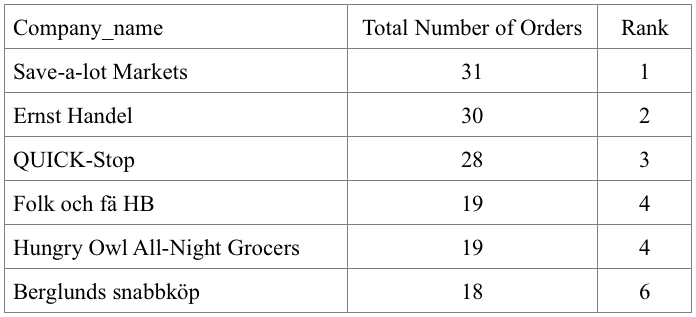
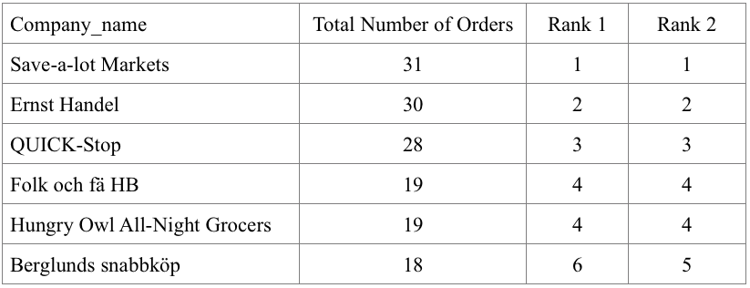
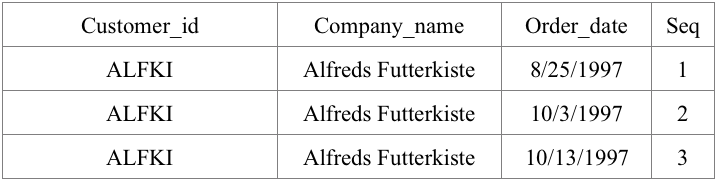
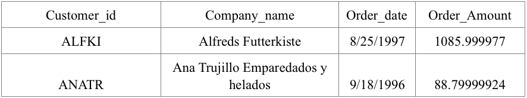

# Advanced Level SQL Questions  

The questions in this section prepares you with the skills of querying the database at the advanced level, including the use of window function, more practice of all kinds of joins, and frequent use of subqueries and common table expressions, known as CTE. The CRM datasets are very likely to be the ones you will encounter in business, such as retailing. Being able to ask relevant questions is critical for business analyst or data scientist. These questions are designed along that.

## Key knowledge to be learned: 

+ Common table expression (CTE)  
+ Window functions  
+ Subqueries (1 and more layers)  


### Q1: Return customer_id, company_name, order_id, order_date, order_amount, and the cumulative (rolling) sum of order amount partitioned by customer_id and ordered by order_id.  
*Hint:  use SUM(order_amount) OVER(PARTITION BY customer_id ORDER BY order_id) and try to use CTE to replace the subquery*  

```sql
WITH CTEtotal_orders AS
(SELECT c.customer_id, c.company_name, o.order_id, o.order_date, ROUND(SUM(od.unit_price*od.quantity)::numeric, 2) order_amount
FROM customers c
LEFT JOIN orders o
ON c.customer_id = o.customer_id
INNER JOIN order_details od
ON o.order_id = od.order_id
GROUP BY c.customer_id, c.company_name, o.order_id, o.order_date
ORDER BY c.customer_id) 

SELECT customer_id, company_name, order_id, order_date, order_amount, 
               SUM(order_amount) OVER(PARTITION BY customer_id ORDER BY order_id) cumulative_sum
FROM CTEtotal_orders
```

### Q2a: Return company_name, total number of orders (return 0 if no order), and a rank based on the total number of orders. When there is a tie between two customers, the rank should be the same, and the following rank should skip the tied rank.  
Example:  
  
*Hint:  use RANK() OVER(ORDER BY SUM(CASE WHEN o.order_id IS NULL THEN 0 ELSE 1 END) DESC)*  

```sql
SELECT c.company_name,
               SUM(CASE WHEN o.order_id IS NULL THEN 0 ELSE 1 END) AS total_order_number,
               RANK() OVER(ORDER BY SUM(CASE WHEN o.order_id IS NULL THEN 0 ELSE 1 END) DESC)
FROM customers c
LEFT JOIN orders o
ON c.customer_id = o.customer_id
GROUP BY c.customer_id, c.company_name
```

### Q2b: Add an additional rank variable (Rank 2) to Q2a which does not skip any ranks.  
Example:  
  
*Hint:  use RANK() OVER() and Dense_RANK() OVER()*  

```sql
SELECT c.company_name,
               SUM(CASE WHEN o.order_id IS NULL THEN 0 ELSE 1 END) AS total_order_number,
               RANK() OVER(ORDER BY SUM(CASE WHEN o.order_id IS NULL THEN 0 ELSE 1 END) DESC) RANK1,
               DENSE_RANK() OVER(ORDER BY SUM(CASE WHEN o.order_id IS NULL THEN 0 ELSE 1 END) DESC) RANK2 
FROM customers c
LEFT JOIN orders o
ON c.customer_id = o.customer_id
GROUP BY c.customer_id, c.company_name
```

### Q2c: Output the company_name and total order count of the top 10 customers based on total order count. If there is a tie on the 10th, include all customers at the 10th.  
*Hint:  use RANK() OVER() as rank and set rank < 11 in the Where clause*  

```sql
WITH CTErank AS
      (SELECT c.company_name,
                      SUM(CASE WHEN o.order_id IS NULL THEN 0 ELSE 1 END) AS total_order_number,
                      RANK() OVER(ORDER BY SUM(CASE WHEN o.order_id IS NULL THEN 0 ELSE 1 END) DESC) rank
        FROM customers c
        LEFT JOIN orders o
        ON c.customer_id = o.customer_id
        GROUP BY c.customer_id, c.company_name)

SELECT * FROM CTErank
WHERE rank < 11
```

### Q3a: We want to know the inter-purchase time (time elapsed between two orders) to understand the purchase frequency for each customer.  Let’s first return customer_id, company_name, order_date, order_date of the previous order for the customer.  
*Hint:  use LAG(o.order_date, 1)  OVER (PARTITION BY c.customer_id ORDER BY o.order_date) AS prev_order_date*  

```sql
SELECT c.customer_id, c.company_name, o.order_id, o.order_date, LAG(o.order_date, 1)  OVER (PARTITION BY c.customer_id ORDER BY o.order_date) AS prev_order_date
FROM customers c
INNER  JOIN orders o
ON c.customer_id = o.customer_id
```

### Q3b: Instead of using the previous order, we can also use the next order to calculate inter-purchase time. Return customer_id, company_name, order_date, order_date of the next order.  
*Hint:  use LEAD(o.order_date, 1)  OVER (PARTITION BY c.customer_id ORDER BY o.order_date) AS next_order_date*  

```sql
SELECT c.customer_id, c.company_name, o.order_id, o.order_date, 
              LEAD(o.order_date)  OVER (PARTITION BY c.customer_id ORDER BY o.order_date) AS next_order_date
FROM customers c
INNER  JOIN orders o
ON c.customer_id = o.customer_id
```

### Q4a: Return customer_id, company_name, order_date, and the sequence of the order for each customer_id.  
Example:  
  
*Hint:  use ROW_NUMBER() OVER(PARTITION BY c.customer_id  ORDER BY o.order_date) AS Seq*  

```sql
SELECT c.customer_id, c.company_name, o.order_date, 
               ROW_NUMBER() OVER(PARTITION BY c.customer_id  ORDER BY o.order_date) AS Seq
FROM customers c
LEFT JOIN orders o
ON c.customer_id = o.customer_id
```

### Q4b: Return customer_id, company_name, the order date and order amount of the first order for each customer_id.  
Example:  
  
*Hint:  use ROW_NUMBER() OVER(PARTITION BY c.customer_id  ORDER BY o.order_date) AS Seq and set Seq =1 in the Where clause*  

```sql
WITH CTEorder_rank AS
(SELECT c.customer_id, c.company_name, o.order_date, o.order_id,
               ROW_NUMBER() OVER(PARTITION BY c.customer_id  ORDER BY o.order_date) AS Seq
FROM customers c
LEFT JOIN orders o
ON c.customer_id = o.customer_id),

CTEorder_amount AS
(SELECT o.order_id, ROUND(SUM(od.unit_price*od.quantity)::numeric, 2) order_amount
FROM orders o
INNER JOIN order_details od
ON o.order_id = od.order_id
GROUP BY o.order_id) 

SELECT cor.customer_id, cor.company_name, cor.order_date, coa.order_amount
FROM CTEorder_rank cor
INNER JOIN CTEorder_amount coa
ON cor.order_id = coa.order_id
WHERE cor.seq = 1
ORDER BY cor.customer_id
```
